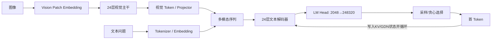
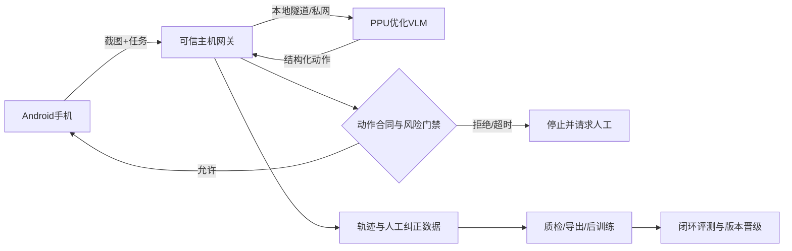

# Qwen3.5-2B 在阿里云 PPU 上的推理优化：技术演进、实验依据与应用设计

> 提交定位：东南大学 AI+ 创新应用大赛，赛道二“端侧 AI 推理优化挑战”
> 目标平台：阿里云 PPU-ZW810E
> 评测模型：Qwen3.5-2B 多模态模型
> 本文状态：提交设计文档；性能数字均来自 PPU 实验，不含 Windows 本地推测值

## 摘要

本项目没有通过更换权重、删减视觉 Token 或修改评测数据换取速度，而是从
Qwen3.5-2B 的真实执行结构出发，对 PPU 上的解码热点、内存访问、算子提交和首 Token
prefill 路径进行逐层优化。最终保留的方案包括 Gated Delta Network（GDN）递推更新、
causal-conv、RMSNorm、gated-RMSNorm、Q/K RMSNorm+RoPE、residual+RMSNorm、MLP、
GDN 投影与 b/a-GEMV 等融合，并将适合多行输入的归一化/残差核扩展到 prefill。

在同一 PPU 实例、同一模型、同一 CN20 数据上，以四个独立进程按
`eager A → candidate A → candidate B → eager B` 复测，吞吐中位由
49.2195 token/s 提升到 133.623 token/s，即 2.71484 倍、提升 171.48%；TTFT 中位由
120.059 ms 降到 114.313 ms，降低 4.79%；四次 Accuracy 均为 17/20，20/20 解析答案与
正确性一致。更激进但失败的 single-GEMV、视觉 Token 缩减、KV 预留和 prefill SwiGLU
均未进入提交代码。本文同时给出基于现有 Mobile GUI-VLA 工程的应用设计：已具备真实
Android 动作闭环、人工示范采集、训练数据质检/导出和危险动作门禁；PPU 上验证的优化
方法可迁移为未来移动端 NPU/GPU 的设计原则，但 PPU 二进制算子本身不能直接跨平台复用。

## 1. 赛题理解与评分对齐

### 1.1 赛题要求

赛题要求参赛者在阿里云 PPU 服务器上对 Qwen3.5-2B 进行推理优化，并用统一评测工具
比较优化前后的精度、首 Token 延迟和吞吐。比赛截图列出的四个总评维度为：

| 总评维度 | 权重 | 本项目的对应工作 |
|---|---:|---|
| 模型推理精度（Ability） | 30% | 权重、视觉 Token 和数据不变；每轮候选先过 Accuracy/答案一致性门槛 |
| 推理延迟优化 | 30% | 独立 profile 首 Token；multi-row prefill norm/residual 融合 |
| 吞吐量提升 | 20% | decode 热点融合、packed MLP、grouped acBLAS、b/a-GEMV |
| 系统级优化 | 20% | HGGC/acBLAS、自定义加载层、持久权重布局、raw stream、可恢复构建脚本 |

截图顶部给出的总评分表达为：

```text
总分 = 0.3 × 精度得分 + 0.3 × 延迟优化 + 0.2 × 吞吐量 + 0.2 × 系统级优化
```

截图“初赛评价指标”的细分框又展示了 Ability、TTFT、Throughput 三项按
`0.4 / 0.3 / 0.3` 组合的初赛公式；“复赛评价指标”则强调 PPU 服务器部署优化与
Qwen3.5-2B 复测，并按相对初赛结果及参数权重计算。两处公式对应不同页面层级或阶段，
不能擅自合并。本项目同时覆盖四个总评维度，最终得分以主办方平台的正式实现为准。

### 1.2 截图中的指标定义

精度得分是对模型原始能力 `P` 在下界 `P_min` 与上界 `P_max` 之间归一化，并在边界外
截断。其核心含义是：优化版本首先不能因为激进近似而失去任务能力。

TTFT（Time To First Token）提升率衡量从输入接收到输出第一个 Token 的时间：

```text
TTFT提升率 = (T_ori - T_opt) / T_ori = 1 - T_opt / T_ori
```

吞吐量（Throughput）提升率衡量进入连续生成后每秒输出 Token 的能力：

```text
吞吐提升率 = (S_opt - S_ori) / S_ori = S_opt / S_ori - 1
```

其中 `ori` 是未启用本项目优化的 eager 基线，`opt` 是当前提交的 `performance` 配置。
TTFT 与吞吐描述的是不同阶段，不能用一个数字代替另一个。

### 1.3 截图列出的提交要求与资源

技术方案需介绍 VLM 应用场景、软硬件结构及优化方法，包含模型系统架构与优化前后的
性能测试；代码实现必须与技术方案对应。比赛提供或指定的资源包括：

1. 专用在线数据集：图像、问题、参考答案及第三方元数据；
2. Qwen3.5-2B 模型权重：Hugging Face / GitHub；
3. 阿里云 PPU 服务器计算资源：主要用于复赛部署与复测；
4. 标准化评测与性能评测工具：初赛和复赛保持统一口径。

截图列出的相关入口包括 2026 AICAS、T-Head Semiconductor、Tongyi Qianwen、
Hugging Face Qwen Model 和 Qwen GitHub；培训内容包括：

1. Qwen3.5-2B 模型架构与推理原理；
2. 阿里云 PPU 服务器使用指南；
3. 模型量化与压缩（PTQ/QAT/剪枝）；
4. 算子融合与计算调度优化；
5. 内存管理与指令集优化。

本提交聚焦第 4、5 项，并以不降低公开集 Accuracy 为硬约束。PTQ/QAT/剪枝没有进入
最终提交，原因是它们需要重新建立模型级精度证据，且 PPU 镜像已有 patched torch 和
平台量化能力，短周期内直接覆盖运行时会增加不可控变量。

## 2. Qwen3.5-2B 如何完成一次多模态推理

### 2.1 端到端数据流



图像先被切成 patch，经视觉 Transformer 提取为视觉 Token；文本被 tokenizer 转为离散
Token，再映射为 hidden state。视觉与文本表示组成同一序列，经过文本解码器。LM head
把每个位置的 2048 维 hidden state 映射到 248320 维词表 logits，最后选择下一个 Token。

推理分为两个计算形态：

- **Prefill / 首 Token：** 一次处理完整图文序列，矩阵行数较多，决定 TTFT；
- **Decode / 后续 Token：** 每轮通常只处理一行 hidden state，重复执行到输出结束，决定
  单请求生成吞吐。

这一区分直接决定本项目为何为两条路径分别设计优化，而不是只写一个“大融合核”。

### 2.2 文本主干的真实结构与张量

本地模型结构核验得到：hidden size 为 2048，MLP intermediate size 为 6144，共 24 层，
其中 18 层是 GDN 线性注意力，6 层是全注意力，约每 4 层出现一个全注意力层。

| 子结构 | 输入/关键张量 | 输出/作用 |
|---|---|---|
| RMSNorm | `[rows, 2048]` | 按行归一化，稳定层间数值尺度 |
| GDN QKV 投影 | `[rows,2048] × [2048,6144]` | 生成 16 个 head 的 q/k/v 表示 |
| GDN z 投影 | `[rows,2048] × [2048,2048]` | 生成门控输出 |
| GDN a/b 投影 | `[rows,2048] × [2048,16]`，各一次 | 生成每个 head 的递推门控参数 |
| GDN causal-conv | 6144 通道、kernel width 4 | 融合当前输入与最近局部历史 |
| GDN recurrent state | 每层 `16 × 128 × 128` | 用固定大小状态压缩长历史 |
| 全注意力 Q+gate | `[rows,2048] × [2048,4096]` | 8 个 Q head 及 gate |
| 全注意力 K/V | 各 `[rows,2048] × [2048,512]` | 2 个 KV head，进入 KV cache |
| MLP gate/up | 两个 `[rows,2048] × [2048,6144]` | `SiLU(gate) ⊙ up` |
| MLP down | `[rows,6144] × [6144,2048]` | 返回 residual stream |
| residual | `[rows,2048] + [rows,2048]` | 保留原表示并叠加新特征 |

GDN 的 key/value head 均为 16，head dimension 为 128。全注意力有 8 个 query head、
2 个 KV head，head dimension 为 256。两类层混合的意义是：GDN 用固定大小递推状态降低
长序列成本，全注意力层周期性恢复显式 Token 间交互能力。

### 2.3 为什么原始实现有较大优化空间

模型在功能层面已经适配 PPU，但“可以运行”不等于“针对该模型固定尺寸调优”。原始 eager
实现把一个数学层拆成多个通用算子，每个算子都要经历 Python/dispatcher 调度、kernel
launch、读取输入、写出中间张量，再由下一个算子重新读取。decode 每层只有一行数据，
单个算术任务很小，提交和访存成本反而占比很高。

因此 171.48% 的吞吐提升并不是“算力凭空增加”，而是原始路径与 Qwen3.5-2B 的
单 Token 固定形状存在明显错配：

1. 18 个 GDN 层和 24 个 MLP 层会在每个 Token 重复触发大量小算子；
2. 通用 eager 算子需要产生临时张量，内存流量高于必要值；
3. 相邻投影与门控原本分开提交，没有共享输入读取与权重布局；
4. 高频 Python/运行时 stream 查询对单 Token 小任务尤其昂贵；
5. PPU 通用库能完成矩阵计算，但不会自动理解整段 Qwen 层级语义并完成跨算子融合。

同类优化思想在 NVIDIA GPU 上也成立，但收益比例不会天然相同：CUDA/cuBLAS、
Transformer Engine、FlashAttention、torch.compile 或成熟推理框架可能已覆盖部分优化；
最终收益取决于原始基线、kernel 质量、模型形状和运行时，而不是由硬件品牌单独决定。

## 3. 从 baseline 到最终版本的技术演进

### 3.1 原则：先测量，再保留

每个候选都遵循同一闭环：

```text
结构分析 → 独立 profile → 最小实现 → PPU 冒烟 → 配对 A/B → 精度门槛 → 保留或撤回
```

性能优化必须同时回答三个问题：热点是否真实存在；修改是否在 PPU 上更快；输出能力是否
保持。只满足前两项但损失正确答案的候选同样被拒绝。

### 3.2 第一阶段：抓住 decode 高频小算子

最初 CN20 eager 基线为 118.493 ms TTFT、49.737 token/s、Accuracy 17/20。逐项加入
GDN recurrent、causal-conv、norm、Q/K+RoPE 等五类融合后的两次完整运行结果为：

| 版本 | TTFT (ms) | 吞吐 (token/s) | 相对 eager 吞吐 | Accuracy |
|---|---:|---:|---:|---:|
| eager | 118.493 | 49.737 | — | 17/20 |
| GDN recurrent | 119.460 | 61.350 | +23.35% | 17/20 |
| GDN + causal-conv | 117.262 | 63.911 | +28.50% | 17/20 |
| all-four | 119.677 | 81.307 | +63.47% | 17/20 |
| all-five r1 | 124.930 | 93.918 | +88.83% | 17/20 |
| all-five r2 | 118.227 | 94.889 | +90.78% | 17/20 |

此前交流中提到的“约 80%”指这一阶段相对 `49.737 token/s` eager 基线的吞吐提升，
不是最终版本相对上一版的增量，也不是 TTFT 提升。实测值实际是 +88.83%/+90.78%。

### 3.3 第二阶段：MLP 与投影路径

24 层 MLP 每个 Token 都执行 gate、up、SwiGLU 和 down。项目把 gate/up 权重整理为持久
连续布局，用单入口 acBLAS 完成投影并用 HGGC 完成激活/乘法，避免每 Token 重复拼接。
在 all-five 之上，packed MLP 两轮达到 96.506/96.715 token/s，相对前一版继续提升
2.76%/2.98%，Accuracy 仍为 17/20。

GDN 输入侧随后使用 grouped acBLAS，减少 Python 往返；只把低风险且相邻的 b/a 两个
小投影并为一次 GEMV。GDN gate-prep 和 raw stream 查询继续减少小 kernel 及高频运行时
开销。这些单项通常只有几个百分点，但在 18/24 层、每个生成 Token 重复后可以累积。

### 3.4 第三阶段：首 Token 独立 profile 与 prefill

早期 profile 会把一次 prefill 和 15 次 decode 混在一起，无法判断 TTFT 真正花在哪里。
本项目改为 `max_new_tokens=1`，用 226 Token 图文 prompt 预热后单独记录首 Token：

- baseline Self PPU：53.154 ms；
- 两组最大 elementwise 合计约 15.449 ms，占 Self PPU 约 29.1%；
- `[226,2048] × [2048,6144]` MLP GEMM 主组为 4.820 ms；
- profile 还显示大量 reduce、copy 和逐行 norm。

因此优先把已验证的按行 RMSNorm、gated-RMSNorm、residual+RMSNorm 核扩展到 multi-row
prefill，而不是先冒险重写大 GEMM。覆盖范围为 49 个 2048 维 RMSNorm、18 个 128 维
gated-RMSNorm，以及 24 层的两条 residual+RMSNorm 边。

双语逐题 AB/BA 结果：

| 数据 | 平均 TTFT baseline→candidate | TTFT 配对中位提升 | 获胜 | Accuracy | 解析答案一致 |
|---|---:|---:|---:|---:|---:|
| CN20 | 117.099→111.362 ms | 4.86% | 18/20 | 17→17 | 20/20 |
| EN20 | 119.189→112.943 ms | 4.48% | 18/20 | 18→18 | 20/20 |

CN20 吞吐配对中位回退 1.68%，EN20 提升 2.57%。最终规则允许不超过 5% 的吞吐回退，
且 Accuracy 与解析答案没有下降，因此保留 multi-row prefill。它是当前最好的 TTFT 版本。

### 3.5 最终独立进程 ABBA

为减小热缓存、运行顺序和单进程状态污染，最终比较使用四个独立进程：

| 指标 | eager A / B | candidate A / B | 中位变化 |
|---|---|---|---|
| 平均吞吐 | 49.682 / 48.757 | 132.806 / 134.440 token/s | 49.2195→133.623，2.71484x（+171.48%） |
| 平均 TTFT | 两个 eager 运行聚合 | 两个 candidate 运行聚合 | 120.059→114.313 ms（-4.79%） |
| Accuracy | 17/20、17/20 | 17/20、17/20 | 不变 |

四次运行 20/20 解析答案和正确性一致，candidate 对 20/20 样本均取得吞吐优势。公开
benchmark 没有保存完整生成文本 hash，因此这里只声明上述经过记录的证据，不宣称 ABBA
四次全文 bit-exact。

## 4. 最终保留的实现

`evaluation_wrapper.py` 在模型加载后检查模型结构和模块数量，只对匹配的
Qwen3.5-2B 模块挂载 PPU 路径。`performance` 配置包含：

| 优化 | 层/模块数 | 主要收益来源 |
|---|---:|---|
| GDN recurrent update | 18 | 融合递推状态读写与逐 head 更新 |
| causal-conv decode | 18 | 固定 width=4，减少通用卷积开销 |
| RMSNorm | 49 | 融合 reduce、缩放和写回 |
| gated-RMSNorm | 18 | 合并归一化、gate 与乘法 |
| Q/K RMSNorm + RoPE | 6 | 合并 attention 前处理和中间张量 |
| packed/acBLAS MLP | 24 | 持久权重布局、减少入口与中间写回 |
| grouped GDN projection | 18 | 减少分散投影的调度成本 |
| b/a-GEMV | 18 | 只合并已过精度门槛的两个小投影 |
| residual+RMSNorm | 24 | 避免 residual 临时结果往返内存 |
| GDN gate-prep | 18 | 合并门控准备阶段的 elementwise |
| raw stream query | 全局 | 避免高频 Python/运行时查询 |
| multi-row prefill | 首 Token | 复用 norm/residual 核处理多行输入 |

实现采用两层职责：HGGC 负责 PPU 侧 elementwise、归一化、递推与融合 kernel；acBLAS
负责矩阵乘/GEMV。Python 只负责模型结构识别、一次性权重准备和调用挂载。构建产物不进
Git，部署时由 `bootstrap_ppu_env.sh` 在官方镜像中重新编译，以避免 SDK/ABI 漂移。

## 5. 没有保留的方向及其价值

失败实验不是“无用代码”，而是确定优化边界的证据；提交分支只保留结论，不保留失败
实现，避免误开开关。

| 方向 | 实验结果 | 决策与原因 |
|---|---|---|
| single-GEMV 合并更多 GDN 投影 | 英文 MMBench 样本 4029 少 1 个正确答案 | 精度硬门槛失败，撤回 |
| 视觉 Token/分辨率缩减 | CN/EN 输出存在漂移，TTFT 收益不稳定 | 有精度风险且非通用底层优化，撤回 |
| KV/首 Token 缓存预分配 | 双语 TTFT 未稳定改善或回退 | 分配节省小于管理/初始化成本，撤回 |
| 仅融合 prefill SiLU+mul | CN TTFT 仅 1.00331x，EN 为 0.97769x | launch 节省不足以覆盖 24 次 Python/ctypes 提交，撤回 |
| 宽 gate/up GEMM + packed SwiGLU | CN2 TTFT 0.96925x，吞吐 0.94718x | TTFT 下降约 3.1%、吞吐下降约 5.3%，撤回 |
| attention-prep/图捕获/临时 workspace | 未形成稳定的双语端到端优势 | 不进入最终 evidence-backed 配置 |

用户最终要求是“不保留性能下降的版本，只保留目前最好的版本”。因此 `performance`
启用 b/a-GEMV 与 multi-row prefill，但没有任何 prefill SwiGLU 实验开关或实现。

## 6. 优势、劣势与结果边界

### 6.1 优势

1. **吞吐优势显著且有直接基线。** +171.48% 是同一 PPU、同一数据、独立进程 eager
   与 candidate 的比值，不是相对一个较早优化版本的宣传数字。
2. **精度优先。** 最激进的 single-GEMV 即使只有一个样本失分也被撤回；最终四次
   Accuracy 均为 85%。
3. **优化覆盖系统全栈。** 不止一个 kernel，而是模型结构、权重布局、算子融合、运行时
   stream、prefill/decode 分流和部署恢复共同作用。
4. **失败方向可解释。** 每个撤回方案都有 PPU A/B 数据，而不是仅凭经验判断。
5. **部署可恢复。** 官方镜像自带 patched torch；脚本用 `--system-site-packages` 建隔离
   venv，并在每次新实例重编扩展，不污染镜像主环境。

### 6.2 劣势与风险

1. **TTFT 上限低于 decode 吞吐。** prefill 含视觉编码、大 GEMM 和大量通用路径，当前
   只融合其中 norm/residual；decode 则每个 Token 反复命中已优化热点，所以累计更大。
2. **形状和模型版本耦合。** 实现检查 18/6/24 等模块数量并针对固定尺寸调优；换模型、
   SDK 或 patched torch 后必须重编和复测。
3. **最终总加速只在 CN20 上完成独立进程 ABBA。** 不能外推为完整公开集或私有集的
   保证；双语证据主要覆盖 prefill 增量与早期阶段。
4. **不是量化方案。** 项目没有额外获得模型体积/显存降低；优势集中在调度、访存和融合。
5. **完整生成文本证据有限。** 最终公开 benchmark 保存了解析答案、正确性和 token 数，
   但没有为 ABBA 保存完整文本 hash。

## 7. VLA 应用：从 PPU 优化到未来移动端闭环

### 7.1 应用目标

现有 `Mobile GUI-VLA` 项目的闭环是：

```text
Task + Screenshot → VLA Policy → 结构化 Action → 安全门禁 → Android
        ↑                                                   ↓
        └──────── 轨迹、下一帧、结果、人工纠正与评估 ────────┘
```

在手机设置、测试 App 等受控场景中，模型读取当前截图和任务，输出 tap、swipe、type、
back、home、wait 或终止动作；主机网关验证动作后通过 ADB 执行，再捕获下一帧进入循环。
该场景把多模态模型的 TTFT 对应为“看到界面到给出第一动作”的反应时间，把吞吐和每步
延迟对应为闭环操作速度，因此与本项目的两类优化指标有直接关系。

### 7.2 当前已经存在的工程能力

以下结论来自本地 Mobile GUI-VLA 工程中的设备平台、人工示范采集器和基线诊断源码，
而非未来设想：

- **设备执行平台：** 截图、坐标映射、tap/swipe/type/BACK/HOME/wait、稳定帧捕获、
  trajectory 持久化、设备会话锁和模型边界校验已有代码与测试；
- **人工示范采集器：** 浏览器端 Prepare→Record→Review 流程，记录原始帧、动作、下一帧、
  结果和人工干预来源；支持 normal、recovery、ambiguous、risk_ood 数据类别；
- **训练数据质检/导出：** 检查帧 SHA-256、轨迹连续性、坐标范围、动作类型、隐私关键字、
  敏感长数字、人工接管来源和训练资格，输出确定性的模型中立 JSONL；
- **危险操作防护：** 模型输出先经 frozen action contract 和安全分类；越界坐标、未知动作、
  菜单等超出 benign envelope 的操作被拒绝；真实手机需要显式 `--physical-phone` 与
  `--ack-sanitized-device`，断连、旧帧或不安全响应采取 fail-closed/安全停止；
- **基线诊断：** 已有 Qwen/GUI-Owl 请求适配、结构化动作解析、坐标配方、受限人工试验、
  最多步数、轨迹归因和任务 oracle。

必须准确说明当前边界：VLA 根 README 把 SFT、checkpoint 管理和闭环 evaluation 列为项目
范围，且采集器已经闭合“可训练数据”的前置链路；但当前可见的三个子仓库没有包含完整
SFT/LoRA/RL 训练实现，采集器 README 也明确“不含训练数据集”，设备平台明确“不含训练
栈”。因此可对外表述为“后训练数据闭环与接口已具备，正式后训练执行层仍需接入并用
checkpoint/闭环评测验收”，不能宣称已经完成模型后训练并取得精度提升。

### 7.3 与本次 PPU 优化的结合方式

近期可把 Qwen3.5-2B 或兼容 VLM 放在边缘服务器/PPU 上，手机只负责画面采集、动作执行
和硬安全门禁：



本次优化可立即改善边缘推理服务的 time-to-first-action 和持续动作生成效率；数据采集与
安全控制仍留在网关/设备侧，模型即使异常也不能绕过动作合同。

### 7.4 未来移动端部署路线

PPU 的 HGGC/acBLAS 源码不能直接复制到手机 NPU/GPU。可以迁移的是已经用实验验证的
方法论：prefill/decode 分路、固定形状专核、相邻 elementwise 融合、持久权重布局、
减少 dispatcher/stream 查询、精度门禁和逐候选 A/B。建议分四步：

1. **建立移动端 baseline：** 冻结同一模型/量化版本、真实手机、任务集和 Accuracy、
   首动作延迟、每步延迟、峰值内存、功耗/温升；
2. **选择移动运行时：** 按目标 SoC 评估厂商 NPU SDK、GPU compute 或跨平台 runtime，
   把 PPU kernel 语义重写为目标后端支持的算子图；
3. **结构化优化：** 先做无损图融合和缓存生命周期，再评估 PTQ/QAT；任何量化版本都走
   normal/recovery/ambiguous/risk_ood 分层集与安全回归；
4. **安全独立化：** action contract、权限/支付/删除/发送等危险操作策略、超时和急停继续
   由确定性宿主代码掌握，不交给模型权重。

若未来模型能够在手机 NPU 上以可接受功耗运行，可将“截图上传到服务器”缩短为本机闭环，
降低网络抖动和隐私暴露；较大模型仍可采用手机小模型快速反应、边缘大模型处理困难样本的
分层架构。其前景来自已有的数据采集、安全门禁和评测基础，而不是假设移动端已经完成。

## 8. 复现、启动与评审检查

### 8.1 一键构建与运行

```bash
bash scripts/bootstrap_ppu_env.sh
export SEU_PPU_VENV_DIR="${HOME}/.cache/seu-vlm-ppu/venv"
source scripts/activate_ppu_env.sh
source scripts/activate_ppu_profile.sh performance
bash scripts/run_submission.sh \
  /path/to/Qwen3.5-2B \
  /path/to/mmbench_dev_cn.tsv \
  result.json
```

快速冒烟可临时设置：

```bash
SEU_NUM_SAMPLES=2 SEU_WARMUP_SAMPLES=1 bash scripts/run_submission.sh \
  /path/to/Qwen3.5-2B /path/to/mmbench_dev_cn.tsv smoke-result.json
```

正式复测不要设置 `SEU_NUM_SAMPLES`。不要在官方 PPU 镜像中安装普通 PyPI/Conda torch；
脚本会复用镜像自带 patched torch，并在隔离 venv 中安装用户态依赖、重编扩展。

### 8.2 提交文件职责

| 路径 | 职责 |
|---|---|
| `evaluation_wrapper.py` | 主办方模型接口、结构核验与优化挂载 |
| `benchmark_public.py` | 统一公开集 Accuracy/TTFT/吞吐入口 |
| `ppu/custom_ops/` | HGGC/acBLAS 源码、Python 包装与构建脚本 |
| `scripts/bootstrap_ppu_env.sh` | 新实例隔离环境与扩展重建 |
| `scripts/activate_ppu_profile.sh` | 选择 evidence-backed `performance` 配置 |
| `scripts/run_submission.sh` | 简易启动和公开自测 |
| `environment-ppu.yml` / `requirements-ppu.txt` | 环境结构与用户态依赖说明 |
| `README.md` | 最短部署说明 |
| `COMPETITION.md` | 完整技术、实验、评分和应用设计（本文） |

### 8.3 最终验收清单

- [x] 提交源码不含失败的 prefill SwiGLU 实现；
- [x] `performance` 只启用当前最佳 b/a-GEMV 与 multi-row prefill；
- [x] Accuracy、TTFT、吞吐均有 PPU 实测依据；
- [x] 模型权重、数据集、构建产物、缓存、SSH 密钥不进入 Git/ZIP；
- [x] 环境在官方镜像中可由脚本重建；
- [x] 技术文档标明公开集范围、全文 hash 限制和跨平台边界；
- [ ] 最终私有集得分：等待主办方统一复测，不能由公开 CN20 结果替代。

## 9. 结论

本项目的核心贡献不是一个孤立 kernel，而是一条以模型结构为起点、以 PPU profile 为
证据、以精度门槛为约束的端到端优化链。最终版本在不更换模型权重和不降低 CN20
Accuracy 的前提下，将吞吐提升到 eager 的 2.71484 倍，并把 TTFT 降低 4.79%。吞吐
增益大于 TTFT 的原因是优化热点在每个 decode Token、每层重复，而首 Token 仍包含视觉
编码和大矩阵乘等未被本轮覆盖的计算。

更重要的是，项目保留了可复现构建、明确的失败边界和面向真实 Mobile GUI-VLA 的落地
路径：模型负责理解和建议动作，确定性平台负责验证、执行、记录和停止；真实失败进入
数据闭环，再由后训练和闭环评测决定下一版是否晋级。这使性能优化不仅是跑分，也能服务于
未来低时延、低功耗、可审计的移动智能体。
