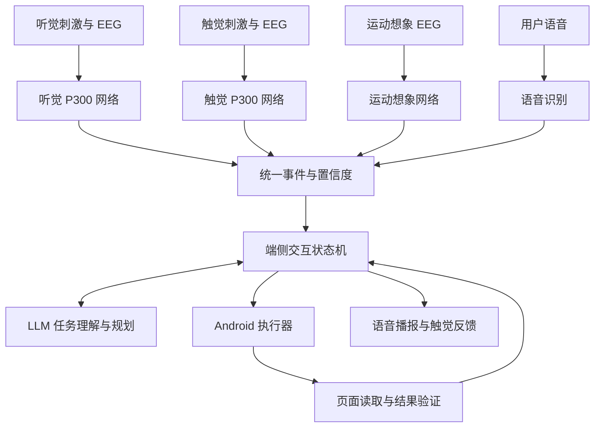

# 多模态脑机接口与端侧手机 Agent：ABC 路线规划

更新时间：2026-09-21

状态：**方案规划，尚未实施和实测。** A/B/C 均保留，具体设备、模型、投入顺序与最终题目由团队评估后确定。本文中的排期为工程估计，不是实验结果或性能保证。

## 1. 目标与应用定位

构建一套端侧 Agent，以小型脑电神经网络解码有限的用户选择，由 LLM 理解任务、生成候选、规划手机操作，并通过语音与用户交互。首先完成可路演的 Android Demo，再按实验结果决定重点路线。

暂定题目：**面向无障碍手机交互的多模态脑机接口与端侧智能代理系统**。

核心问题：脑电输入带宽低且存在不确定性，如何通过任务规划与共享控制，让用户用更少的选择完成复杂手机任务？

视障用户已有读屏与语音控制工具。因此需要验证实际新增价值，优先考虑手部操作受限、不便持续说话等使用情境，不预设脑电优于现有交互。后续可扩展到上肢运动受限或言语表达受限用户；各类人群需求分别验证。

本方向属于新增产品规划，不是 PPU 比赛已完成成果，也不改变其固定模型、评测接口或正式提交配置。旧 RAG 竞赛审查原型与本方案分开保留。

## 2. 总体架构：一个 Agent，三种脑电输入与语音

| 模块 | 职责 | 输出与边界 |
|---|---|---|
| EEG 采集与预处理 | 时间同步、滤波、分段、信号质量检测 | 脑电片段、刺激标记、质量状态 |
| 小型神经网络 | 目标刺激或运动想象分类 | 类别概率；不直接解码任意思想或完整语言 |
| 交互状态机 | 固定菜单、累积证据、拒识、超时、撤销、防重复触发 | 经确认的语义事件 |
| LLM | 解释任务、生成候选、规划步骤、总结结果 | 结构化计划；不擅自改动已确认的用户意图 |
| Android 执行器 | Intent/API、控件操作、必要时手势 | 实际执行状态与失败原因 |
| 结果验证器 | 比较目标与应用状态 | 成功、失败、无法确认 |
| ASR/TTS | 自然语言输入与可听反馈 | 任务文本、候选播报、执行结果 |

LLM 接收结构化事件，而非原始 EEG。事件建议包含 `session_id`、`round_id`、`mode`、`candidate_id`、`confidence`、`timestamp`、`signal_quality` 和来源（实时/回放/模拟）。概率需经校准，不应默认等于真实正确率。

LLM 生成菜单后，当前轮次内候选内容与顺序固定。只有切换轮次才能更新，防止用户关注的选项与系统解释不一致。

A/B 可共享网络结构和基础代码，但应分别训练或校准；C 使用独立预处理、模型和决策逻辑。第一版以切换输入模式为主，暂不承诺三种脑电同时融合。

## 3. A：听觉 P300

### 原理与流程

用户先听候选解释，再关注目标声音。系统记录各刺激实际播放时间，对刺激后的 EEG 分段，识别目标相关事件电位，累积多轮证据形成选择。这里识别的是对刺激的关注反应，不是用户默念内容。

建议流程：候选说明 → 短声音刺激序列 → 目标概率累积 → 达到阈值或轮次上限 → 确认/重试 → Agent 执行 → 播报结果。内容播报与刺激时段先分开设计。

### 实现工作

- 配置音频刺激、随机顺序、间隔、重复次数与事件标记。
- 测量输出延迟，避免将软件发出播放命令的时刻直接视为声音到达的时刻。
- 预处理参数仅在训练集/校准数据上确定；在线流程与训练保持一致。
- 以 EEGNet 为小网络候选，同时保留线性分类器基线。
- 输入张量在统一接口中表达为 batch × channels × samples，适配器再转换为具体网络布局。
- 输出目标/非目标概率，再按候选累积；低置信度重试，不能强制每轮产生选择。

### 演示任务

选择“闹钟” → 选择预置时间“明早七点” → 确认 → Agent 设置并读取结果。自由时间、联系人和长文本可通过语音或分层菜单输入。

### 利弊与创新空间

优势：不增加触觉硬件；流程容易解释；与播报、候选菜单集成方便。

代价：需要等待刺激；占用听觉注意力；音频与脑电同步需要验证；不同用户可能需要校准。

可研究：LLM 根据上下文减少候选数量并保留“其他/返回”；按置信度自适应结束刺激；衡量减少选择轮数是否损害任务覆盖率。

## 4. B：触觉 P300

### 原理与流程

以不同位置的触觉刺激代替声音刺激，用户关注目标位置，EEG 网络识别相应反应。语音负责说明位置含义与执行结果。仅通过按键响应振动不属于本路线的 EEG 解码验证。

已有盲文显示器上的触觉 P300 研究与开放数据，但自制振动装置与该数据有刺激、位置和设备差异，必须重新验证。

### 实现工作

- 在公共架构上增加多位置刺激器、控制器、时间标记与刺激配置。
- 根据舒适度、可区分性和同步条件确定位置数量，不预先承诺八分类。
- 测量刺激起止与机械延迟；比较命令时间与实际触觉事件。
- 训练独立触觉模型，保存个人校准配置。
- 检查电磁、机械和动作伪迹，排除分类器只学到刺激装置噪声的情况。
- 区分“用于选择的触觉刺激”和“执行完成的触觉提示”，避免混淆。

### 演示任务

语音介绍三个任务与位置映射 → 用户关注目标位置 → 解码选择“播放音频” → Agent 执行 → 播报结果。

### 利弊与创新空间

优势：选择刺激不占用声音通道；硬件可展示；贴近非视觉交互；可研究个性化刺激。

代价：新增硬件与同步工作；佩戴状态、位置和个体触觉差异影响体验；并行听觉与触觉仍可能竞争注意力。

可研究：串行/交错播报与刺激调度；按用户优化刺激位置和强度；在相同任务下与 A 比较总耗时和负担。不能未经实验就宣称触觉和听觉完全互不干扰。

## 5. C：运动想象

### 原理与流程

解码左/右手等运动想象类别，再映射为“确认/下一项”等控制事件。网络识别的是运动想象模式，“确认”是软件赋予的含义。

第一版使用提示式窗口：播报候选 → 提示开始想象 → 有限时间内解码 → 确认或切换。随后再研究无需提示的异步控制。

### 实现工作

- EEGNet/紧凑时序模型与 CSP + 线性分类器对照。
- 公共运动想象数据跑通流程，再在实际设备上个人校准。
- 严格区分实际运动与运动想象样本。
- 静息/无控制数据用于拒识与误触发测试；左右二分类本身不解决无指令状态。
- 增加置信度条件、持续性判定、触发锁定和撤销机制。
- 检查肌电、眼动和真实动作混杂；保留跨会话评测。

### 演示任务

语音提出“设置明天的提醒” → Agent 生成方案并播报 → 运动想象确认或切换 → 执行并反馈。无语音模式通过菜单扫描逐步选任务，代价是更多轮次。

### 利弊与创新空间

优势：无需刺激序列；有限指令可复用到不同手机任务；适合探索运动受限用户的共享控制。

代价：跨人、跨天差异；校准成本；异步误触发；离线分类成绩不等于实时使用效果。

可研究：Agent 自动完成中间步骤，用户只决策关键节点；低置信度重询问；个体校准效率；静息时的误触发控制。

## 6. ABC 对比与当前建议

| 维度 | A 听觉 P300 | B 触觉 P300 | C 运动想象 |
|---|---|---|---|
| 主要输入 | 对声音目标的关注 | 对触觉目标的关注 | 运动想象类别 |
| 额外刺激装置 | 音频输出 | 多位置触觉装置 | 无刺激序列需求 |
| 主要工程风险 | 音频同步、听觉负担 | 刺激硬件、同步、伪迹 | 校准、跨会话差异、无指令误触发 |
| 原型展示 | 易解释、任务闭环直观 | 穿戴硬件与非视觉特色 | 关键决策共享控制 |
| 优先研究点 | 减少候选与刺激轮数 | 触听协作与个性化刺激 | 可靠触发与减少用户操作 |

建议顺序：公共 Agent 与语音 → A → B → C。这是当前工程建议，不是已决定的实施路线或算法优劣结论。有现成设备、数据或导师积累时应重新排序。

## 7. 语音及辅助表达模块

| 模块 | 用途 | 优先级 |
|---|---|---|
| ASR 语音识别 | 输入开放任务、时间、联系人与内容 | 第一版 |
| TTS 语音合成 | 播报候选、页面摘要、待执行操作与结果 | 第一版 |
| 脑电选项转语音 | 从常用需求中选择，由系统组织并读出表达 | 后续扩展 |

可扩展题目：面向言语表达受限用户的辅助沟通终端。例如选择“需要喝水”，输出对应语音。LLM 可改善表达，但不能增添未经确认的需求。此模块不是脑电直接解码任意语言。

播报与 ASR 需考虑回声、打断和模式切换；A 的刺激期间应有明确调度策略，防止提示音被当作用户语音或污染实验事件。

## 8. Android 与端侧部署

- 手机承担 Agent 状态管理、EEG 小模型推理、任务规划、操作与反馈。
- 根据 EEG 设备实际支持选择 USB/BLE/Wi-Fi 等接口，并确认采样时间戳、丢包处理和同步能力。
- 控制优先使用应用支持的 Intent/API 与无障碍控件，必要时使用手势；每个目标应用分别验证兼容性。
- 执行后读取状态，不能将“点击已发送”直接等同于“任务已完成”。
- LLM 输出限定工具与参数，状态机负责检查；当前 Demo 使用闹钟、音频播放和消息草稿等易核验任务。
- ASR、TTS、小模型与 LLM 是否全部离线，需要逐一实测；手机内存、发热和后台限制纳入验收。
- LiteRT/LiteRT-LM 等可作为候选运行栈，最终依据手机型号与模型兼容性确定。
- 开发期可以使用 PC/服务器辅助训练与对照，但展示时标明端侧、端云协同和数据回放的实际状态。
- PPU 项目经验可复用到模型部署与性能分析；PPU 上的优化结果不能直接当作手机加速结果。

建议记录手机型号、Android 版本、模型版本/精度、推理后端、应用版本、采集设备、采样率、电极布局和配置，以便复现。

## 9. Demo 阶段规划

以下为设备可用且团队具备基础开发能力时的工作量估计，采集协调、校准和实验失败可能延长周期；并行模块的工作量不等于总日历工期。

| 阶段 | 交付 | 估计 | 完成依据 |
|---|---|---|---|
| 公共底座 | Agent、ASR/TTS、三个任务与结果检查 | 1–2 周 | 真实手机任务可重复完成 |
| 信号接口 | EEG 回放、网络推理、事件统一、状态面板 | 约 1 周 | 来源标注与事件链可追溯 |
| A 在线输入 | 听觉刺激、同步、校准、实时选择 | 1–2 周起 | 在线目标选择与任务闭环 |
| B 在线输入 | 刺激硬件、时序验证、校准、实时选择 | 2–3 周起 | 实际触觉事件与 EEG 同步验证 |
| C 在线输入 | 提示式训练与确认/切换 | 2–3 周起 | 无指令测试及跨会话结果 |
| 集成路演 | 模式切换、撤销、异常恢复、任务对比 | 约 1 周 | 整段演示可重复且错误可恢复 |

第一版任务集：设置指定闹钟、播放指定音频、生成并展示消息草稿。固定任务定义和成功判据，ABC 使用同一任务集。

路演建议展示：输入模式、实时/回放/模拟标记、信号质量、候选概率、最终选择、Agent 当前步骤与实际手机结果。回放演示可以验证接口，但不能充当实时脑控成功证据。

## 10. 实验设计与验收指标

| 层级 | 指标 |
|---|---|
| EEG | 选择正确率、拒识率、校准时长、每次选择耗时；C 的静息误触发次数/分钟 |
| 任务 | 成功率、总完成时间、选择次数、错误恢复次数 |
| 端侧 | EEG/LLM 推理延迟、内存、能耗或温升、断网可用性 |
| 用户体验 | 听觉/触觉负担、佩戴体验、主观工作负荷 |

必要对照：同一 EEG 输入下的固定菜单与 LLM 规划；语音操作基线；小网络与传统分类器；固定重复次数与自适应停止。

时间分解应至少包含刺激/想象、证据累积、LLM 规划、手机执行和播报，定位瓶颈后再优化。

数据按试次、会话或参与者隔离；禁止把重叠窗口随机拆进训练和测试。阈值、预处理及模型选择不使用测试标签。报告受试人数、测试范围和重复次数，不只展示最佳一次。

明眼参与者闭眼实验只说明非视觉原型可用，不能替代视障用户评估。真实参与者实验需按合作机构要求处理知情同意、数据授权及相应审查。使用合适的隔离采集设备，原型不作诊疗效果声明。

## 11. 待选型事项与研究贡献候选

待确认：脑电设备与 SDK、电极配置、目标手机、预算、团队人数、路演日期、医工合作条件、实际目标用户以及最终重点路线。尚未采购设备、训练模型或实施 Android 应用。

潜在贡献（均待实验证明）：

1. LLM 任务规划减少脑电选择次数，同时保持任务成功率。
2. 将置信度、拒识和用户确认接入 Agent，降低误操作与恢复成本。
3. A/B/C 与语音统一接口，支持按能力与场景切换输入。
4. 刺激调度与播报协同，降低交互等待和负担。
5. 端侧实现可复现的延迟、资源和离线任务闭环。

当前交付仅为规划文档；不得写成已经完成真实脑电实验、临床验证或端侧性能提升。

## 12. 参考资料

- [EEGNet 原始论文](https://arxiv.org/abs/1611.08024)：紧凑脑电分类网络。
- [无视觉支持的听觉 P300 设计](https://link.springer.com/article/10.1007/s11571-022-09901-3)：A 路线的研究依据。
- [触觉 P300 与盲人参与者开放数据](https://doi.gin.g-node.org/10.12751/g-node.dyby2g/)：B 路线参考，不能假设直接迁移到自制刺激器。
- [PhysioNet 运动执行/想象 EEG 数据](https://www.physionet.org/content/eegmmidb/1.0.0/)：C 路线起步数据。
- [Android 无障碍功能概览](https://support.google.com/accessibility/answer/6006564?hl=en)：现有读屏和语音交互基线。
- [AccessibilityService 官方接口](https://developer.android.com/reference/android/accessibilityservice/AccessibilityService)：手机执行器参考。
- [Google AI Edge 官方移动示例](https://github.com/google-ai-edge/litert-samples)：端侧推理候选实现。
- [AndroidWorld](https://arxiv.org/abs/2405.14573)：任务初始化与结果验证的实验设计参考。

引用支撑相关范式和工具存在，不代表本文设计已验证或优于现有方法。
